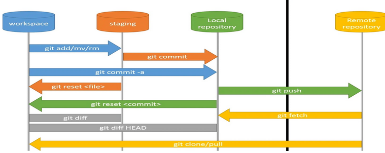

# Qüestions generals

## Apunts en general

[Apunts de Java (Álex García)](assets/1.1/apuntes_java-alex_garcia.pdf) Introducció molt completa i amb exemples.

## Eines de desenvolupament

[Pàgina oficial de Git](https://0.1/git-scm.com/)

[Manual oficial de Git](https://git-scm.com/book/es/v2)

[Manual ràpid de Git](assets/0.1/comandos_git.pdf)



[Presentació de Git](assets/0.1/presentacio_git.odp)

[Netbeans](https://www.netbeans.org)

[JDoodle: online compiler and editor](https://www.jdoodle.com/)

## Instal·lació de Java

Instal·lar OpenJDK darrera versió

``` 
sudo apt-get install default-jdk

```

Instal·lar OpenJDK 16 (canviar 17 per la versió requerida)

    sudo apt install openjdk-17-jdk

Convé tenir instal·lades la versió 8 i la darrera.

Per gestionar les diferents versions de Java

    sudo update-alternatives -opcions ordres

Per canviar la versió de java per defecte:

    sudo update-alternatives --config java
    sudo update-alternatives --config javac

Per afegir la variable d'entorn JAVA\_PATH, editar el fitxer
/etc/environment:

    sudo nano /etc/environment

afegint la línia:

    JAVA_HOME="YOUR_PATH" #escriure aquí la ruta al nostre SDK (veure update-alternatives)

Per carregar el fitxer d'entorn:

    source /etc/environment

Comprovació que s'ha carregat bé:

    echo $JAVA_HOME

Instal·lar [Netbeans
IDE](/materials/general/preparacioprogramari#Instal·lació%20dels%20editors).

## Instal·lació de MariaDb

Instal·lar MariaDb:

    sudo apt-get install mariadb-server mariadb-client

Crear un usuari per administració:

    sudo mariadb -u root
    create user admin@localhost identified by 'adminadmin';
    grant all privileges on *.* to admin@localhost with grant option;
    flush privileges;
    exit

## Instal·lació de Apache2

Instal·lar Apache 2:

``` 
sudo apt install apache2

```

Instal·leu apache2

    sudo apt install apache2

Comproveu que s'ha activat

    sudo systemctl status apache2

Si no està activat, activar el servei:

    sudo systemctl start apache2

Comprovar: al navegador obriu la url <http://localhost>, ha de mostrar
la pàgina d'inici d'apache (/var/www/html/index.html). Ja que per
defecte *DocumentRoot* és **/var/www/html**

A la instal·lació d'apache el servei queda *enabled* (s'activarà
automàtic al engegar la màquina). Per comprovar-ho

    sudo systemctl is-enabled apache2.service

Si estigués *disabled*, configureu el servei **apache2** perquè s'activi
automàtic al engegar la màquina

    sudo systemctl enable apache2

## Instal·lació de php

Instal·lació de la darrera versió (aquí exemplificada la versió 8):

    sudo apt update
    sudo apt install software-properties-common -y
    sudo add-apt-repository ppa:ondrej/php
    sudo apt install php8.0
    sudo apt install libapache2-mod-php8.0 php8.0-mysql
    sudo apt install php8.0-gd php8.0-xml php8.0-mbstring php8.0-soap
    sudo systemctl restart apache2

Comproveu la versió de PHP.

    php -v

Reinicieu apache (si no ho heu fet encara):

    sudo systemctl restart apache2

Al apache2 activeu els mòduls de php.

    sudo a2enmod php8.0

Reinicieu el servei.

    sudo systemctl restart apache2

Per comprovar que el servidor apache funciona amb fitxers PHP. Al
directori *DocumentRoot* del servidor (per defecte /var/www/html),
afegiu un fitxer *phpinfo.php* amb el contingut:

``` php
  <?php
    phpinfo();
  ?>
```

Al navegador obriu la URL <http://localhost/phpinfo.php>

Més informació a <https://help.ubuntu.com/lts/serverguide/php.html.en>

### Configuració Apache per mostrar els errors de PHP (només per a desenvolupament)

Editeu el fitxer de configuració **php.ini**

    sudo gedit /etc/php/8.0/apache2/php.ini

Editeu les següents línies.

    error_reporting = E_ALL & ~E_DEPRECATED & ~E_STRICT
    display_errors = On
    ;disable opcache (no optimization for development environment)
    opcache.enable=0

Reinicieu el servei.

    sudo systemctl restart apache2

### Habilitar a apache public\_html directoris d'usuari

Crear directori *public\_html* al 'home' de l'usuari.

    sudo mkdir ~/public_html

Canviar els permisos del directori d'usuari, per que qualsevol usuari
pugui llegir i executar els fitxers (escriure solament el propietari).

    sudo chmod 755 ~/public_html

Activar el mòdul d'apache que permet tenir l'espai web d'usuari.

    sudo a2enmod userdir

Per defecte, el PHP està desactivat als directoris d'usuari.

Editar el fitxer de configuració del mòdul PHP del servidor web.

Una bona pràctica és, abans d'editar un fitxer de configuració, fer una
còpia (sempre heu de poder fer un rollback):

    sudo cp -p /etc/apache2/mods-available/php8.0.conf /etc/apache2/mods-available/php8.0.conf.orig
    sudo nano /etc/apache2/mods-available/php8.0.conf

Comentar les següents línies (afegint \# al davant).

    <IfModule mod_userdir.c>
        <Directory /home/*/public_html>
            php_admin_flag engine Off
        </Directory>
    </IfModule>

Reiniciar el servei.

    sudo systemctl restart apache2

La URL per accedir a l'espai web d'usuari (substituir user pel nom de
l'usuari).

`http://localhost/~user/`

Per comprovar que el PHP funciona, copieu el fitxer phpinfo.php a
*\~/public\_html* i obriu-lo des del navegador:

`http://localhost/~user/phpinfo.php`

## Instal·lació dels editors

**Instal·lació de VSCodium**

Descarregar i instal·lar el paquet des de <https://vscodium.com/>

**Instal·lació de NetBeans**

Descarregar i instal·lar des de <https://netbeans.apache.org/>

**Instal·lació de Geany**

    sudo apt install geany
