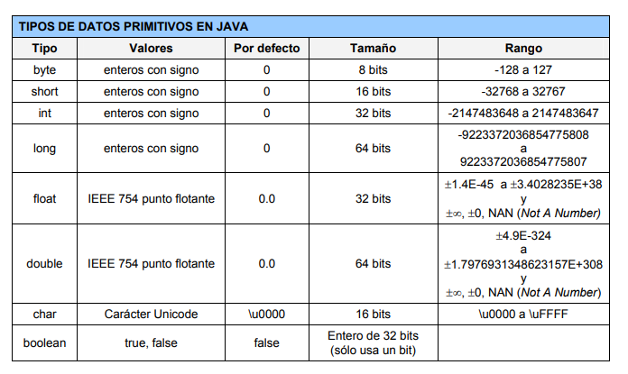
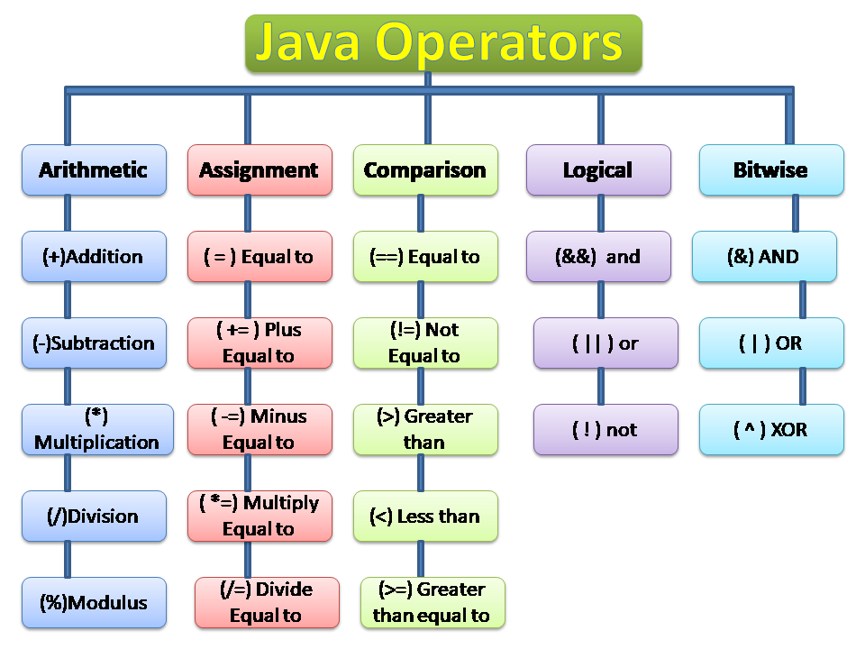

# Dades, operadors i expressions

## Dades i tipus de dades

El propòsit d'un programa és processar dades. Aquestes dades s'han d'emmagatzemar en memòria. Per accedir a les dades en memòria, els programes utilitzen el concepte de **variable**.

Una variable ve definida pels seus atributs: 

  - **Nom o identificador**: El nom ens permet identificar unívocament l’objecte.
  - **Tipus**: El tipus indica el conjunt de valors que pot tenir i quines operacions s’hi poden aplicar.
  - **Valor**: El valor d’un objecte no ha de ser necessàriament un número. El valor d’un objecte serà un element del conjunt al qual pertany i que ve indicat pel seu tipus corresponent. Un objecte podrà ser constant si el seu valor no és modificable o variable si el seu valor es pot modificar. 

Un objecte és una **instància** de la classe o tipus de dada de l’objecte. Instanciar un objecte implica reservar-li un espai de memòria, inicialitzar el seu valor i associar la seva ubicació en memòria amb un identificador que pugui ser utilitzat pel programador en el disseny de l’algorisme per accedir-hi.

Java té dues grans categories de tipus de dades:

- tipus primitius
- tipus referencials

Els **tipus primitius** estan incorporats dintre de la sintaxi del llenguatge de programació, i s'utilitzen per construir-ne d'altres més complexos. Les variables de tipus primitius es creen en memòria en definir-les i el seu valor és el de la dada emmagatzemada en memòria.

Els **tipus referencials** són tota la resta. Corresponen a estructures de dades més complexes i a objectes. El valor de la variable de tipus referencial no és el que està emmagatzemat en memòria, sinó una referència (un apuntador) al lloc on està emmagatzemat. Aquestes variables no s'inicialitzen en declarar-les, sinó que cal contruir els objectes amb un operador del llenguatge (***new***).



## Operadors i expressions

Per realitzar transformacions i operacions amb les dades s'utilitzen els **operadors**.

Normalment, els operadors actuen sobre dades (**operands**) d'un mateix tipus.

Els operadors que actuen sobre un únic operand s'anomenen **unaris**. Els que actuen sobre dos operands s'anomenen **binaris**.



Les **expressions** són combinacions de constants, variables, operadors, parèntesis i noms de funció. Cada expressió avalua a un valor que ve donat per l’aplicació dels operadors als operands i que correspon a un dels tipus de dades. En llenguatge algorísmic considerarem que existeix **sobrecàrrega d’operadors**, és a dir, que un mateix símbol d’operador crida a diferents funcions segons el tipus d’objectes que té com a operands. Per exemple, a/b realitzarà la divisió entera de a i b si les dues variables són enteres, però calcularà la divisió real si es tracta de variables reals. Si els operands són de diferent tipus, és necessari realitzar un canvi de tipus previ (***type cast***).

L'avaluació d'una expressió es realiza avaluant els parèntesis, començant pels més interns i aplicant als operadors la seva precedència.

Per ser correcta, una expressió ha de tenir **correctesa sintàctica** (ordre correcte de les parts que componen l’expressió) i **correctesa semàntica** (l’aplicació de l’operador sobre els seus operands té sentit).


La manera natural d’especificar que una variable ha de tenir un valor donat és l’**operació d’assignació**, que en llenguatge Java realitza l'*operador =*. Es tracta d’una operació destructiva perquè es perd el valor que contenia prèviament la variable assignada. El valor assignat a la variable ha de ser del seu mateix tipus. Cas contrari, ha de fer-se prèviament una conversió de tipus (*type cast*). Cal tenir molta cura amb aquestes conversions, que molts llenguatges efectuen de manera silenciosa, perquè poden ocultar errors en temps d’execució difícils de detectar.

El segon membre de l’assignació pot ser qualsevol expressió en què es tingui una combinació de variables, constants i operadors, el resultat de la qual serà el valor que s’assignarà a la variable indicada. La forma general de l’enunciat d’assignació és, doncs,

```
variable = expressió;
```

Exemple:
```
int a, b, x;
...
x = (a + b) /2;
```

## Declaració de variables i constants

Tota variable ha d'estar declarada abans de ser usada dintre d'un programa.

La **declaració** consisteix en donar-li un **identificador** (el seu nom amb el qual serà coneguda dintre del programa) i un **tipus de dada**, el qual no podrà canviar durant tota la seva existència en memòria. Addicionament, es pot **inicializar** (donar-li un valor inicial).

El format de la declaració és:

```java
tipus identificador;
```

Exemples:

```java
int comptador;
char lletra;
float amplada;
double salari;
int repeticions = 4;
float area = 3.5f;
int a, b, c;
```

L'àmbit d'un identificador de variable és el context en què està declarada. Els idenficadors de variable es poden utilitzar només dintre del bloc de codi en què s'han declarat.

Si una dada no ha de ser modificada durant l'execució del programa, cal definir-la com a **constant**, utilitzant el modificador **final** a la seva definició. En aquest cas, cal inicialitzar-la en el moment de la declaració.

```java
final int NOMBRE_DE_COSTATS = 3;
```

## Conversió de tipus

La conversió de tipus consisteix en la transformació d'una dada d'un tipus a un altre.

La conversió la pot fer de forma **implícita** el propi compilador si es tracta de tipus i valor compatibles i es requereix per a l'avaluació d'una expressió.

```java
float a = 3.0;
int b = 2;
float suma = a + b;
```

També es pot expressar de forma **explícita** indicant el tipus entre parèntesis abans de la variable.

```java
int iVal = 3;
double dVal = (double) iVal;
```
## Representació de les dades

[Apunts de representació de dades](assets/1.1/dam-m03-uf1-representacio_dades.pdf)
