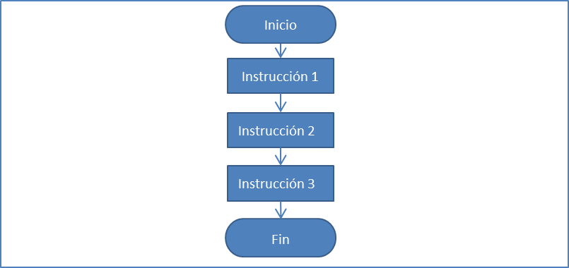

# Estructures seqüencials

Les estructures seqüencials són les més senzilles, ja que consisteixen en l'execució ordenada de les instruccions, una darrera de l'altra, en el mateix ordre en què s'ha escrit.

El flux d'execució del programa conté una única línia que va de l'inici de l'algorisme fins al final, passant per cadascuna de les seves instruccions seguint l'ordre d'escriptura.



[Eina per fer diagrames de flux: diagrams](https://app.diagrams.net/)

**Exemples**

```java
import java.util.Scanner;
/**
 * Llegeix una distància en milles marines i la converteix a metres.
 * @author Jose
 */
public class MillesAMetres {
    public static void main(String[] args) {
        final double MILLES_A_METRES = 1852;  //factor conversió constant
        Scanner lector = new Scanner(System.in);
        //llegir distància en milles
        System.out.print("Entra la distància en milles: ");
        double distanciaEnMilles = lector.nextDouble();
        //calcular conversió de milles a metres
        double distanciaEnMetres = 
                distanciaEnMilles * MILLES_A_METRES;
        //imprimir resultat a l'usuari
        System.out.println(
          distanciaEnMilles + " milles equivalen a " 
                  + distanciaEnMetres + " metres"
        );
    }
}
```

```java
import java.util.Scanner;
import java.util.InputMismatchException;
/**
 * Llegeix el radi d'un cercle i calcula i imprimeix la seva àrea
 * Captura excepció de format de dades invàlides
 * @author Jose
 */
public class AreaCercle {
    public static void main(String[] args) {
        System.out.print("Entra el radi del cercle: ");
        Scanner lector = new Scanner(System.in);
        try {
            //llegir el radi
            double radi = lector.nextDouble();
            //calcular l'àrea
            double area = Math.PI * radi * radi;
            //imprimir resultat
            System.out.format(
                "L'àrea del cercle de radi %.2f és %.2f\n",
                radi, area);
    //        System.out.println(
    //            "L'àrea del cercle de radi " + radi + " és " + area
    //         );
        } catch (InputMismatchException e) {
            System.out.println("Dades invàlides");
        }
    }
}
```