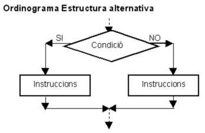
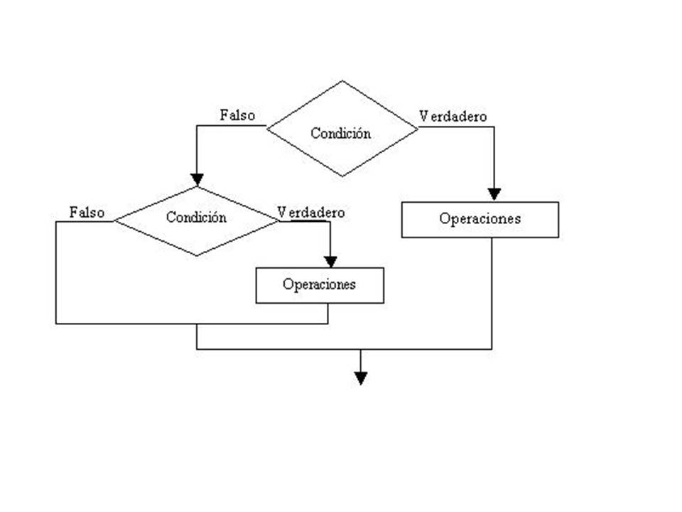
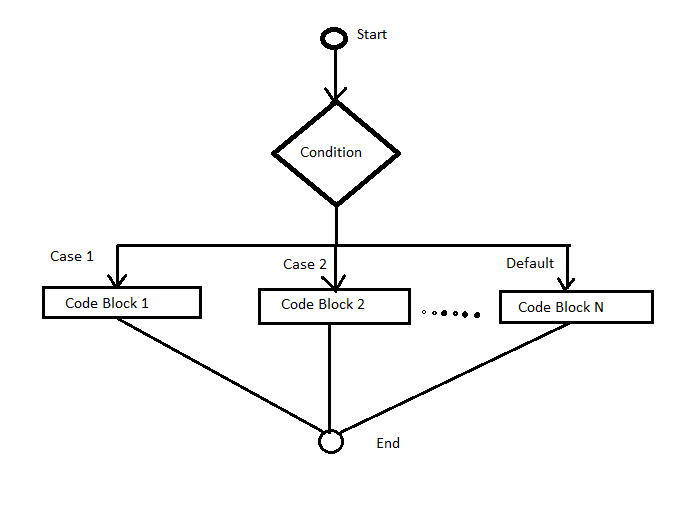

# Estructures condicionals

## Introducció

[Eina per fer diagrames de flux: diagrams](https://app.diagrams.net/)

Les sentències condicionals contenen instruccions que es poden executar o no en funció del valor d'una condició.

En funció del nombre de branques de codi, es poden classificar en:

* condicional simple
* condicional doble
* condicional múltiple

## Condicional simple

Només una branca de codi amb execució opcional. Si es compleix la condició, s'executa el bloc de codi, si no es compleix, no s'executa cap instrucció del condicional i el control passa a la instrucció que segueix l'estructura. 

Es un cas simplificat del condicional doble.

L'expressió de la condició pot utilitzar els operadors relacionals i lògics.

**Operadors relacionals**

|operador | significat  |
|--- |---|
|```>```	| Major que |
|```<```	| Menor que |
|```==```	| Igual a  |
|```>=```   | Major que o igual a  |
|```<=```	| Menor que o igual a  |
|```!=```	| Diferent de  |

**Operadores lògics**

|operador | significat  |
|--- |---|
|&&	| AND  |
|```||```	| OR  |
|!	| NOT  |

AND (Y), OR (O), NOT (NO)

## Condicional doble

La part lògica de l'ALU (la unitat aritmètico-lògica del processador) dota l'ordinador de la capacitat de prendre decisions. Això s'implementa en llenguatge algorísmic mitjançant la contrucció **si-llavors-sinó**. La decisió s'especifica en una expressió lògica, la qual ha d'avaluar a cert (*true*) o fals (*false*).



```
si		"condició"
llavors	"alternativa certa"
[sino	"alternativa falsa"]
[fi_si]
```
Les estructures condicionals es poden **enniuar**, es a dir, que una de les branques pot contenir una altra estructura condicionals si és necessari.



```java
int edat;
...
String missatge;
if (edat >= 0) {
    if (edat >= 67) {
        missatge = "estàs jubilat";
    } else {
        missatge = "no estàs jubilat";
    }
} else {
    missatge = "edat no vàlida";
}
```

## Condicional múltiple

Quan la condició a avaluar pot prendre més de dos valors, s'utilitza el condicional múltiple.



*Exemples*

```java
import java.util.Scanner;
/**
 * Llegeix el número de dia de la setmana i 
 * mostra el dia de la setmana
 * @author Jose
 */
public class DiaSetmana {
    public static void main(String[] args) {
        Scanner lector = new Scanner(System.in);
        //llegir número de l'1 al 7 (dia de la setmana)
        System.out.print("Entra el dia de la setmana: ");
        int dia = lector.nextInt();
        System.out.println("Has entrat el dia: " + dia);
        //mostrar dia de la setmana
        switch (dia) {
            case 1: 
                System.out.println("Oh, avui és dilluns");
                break;
            case 2: 
                System.out.println("Avui és dimarts");
                break;
            case 3:
                System.out.println("Avui és dimecres");
                break;
            case 4:
                System.out.println("Avui és dijous");
                break;
            case 5:
                System.out.println("Avui és divendres. Hurra!, demà serà dissabte");
                break;
            case 6:
                System.out.println("Avui és dissabte");
                break;
            case 7:
                System.out.println("Avui és diumenge. Ohh! demà serà dilluns");
                break;
            default:
                System.out.println("Número de dia incorrecte");
                break;
        }   
    }
}
```

```java
import java.util.Scanner;
/**
 * Llegeix qualificació i mostra comentari
 * @author Jose
 */
public class Qualificacio {
    public static void main(String args[]) {
        Scanner lector = new Scanner(System.in);
        //llegir la qualificació
        System.out.print("Entra la teva qualificació: ");
        char qualificacio = lector.next().toUpperCase().charAt(0);
        //mostrar la qualificació entrada
        System.out.println("La teva qualificació és " + qualificacio);
        //mostrar comentari
        switch (qualificacio) {
            case 'A':
                System.out.println("Excel·lent!");
                break;
            case 'B':
            case 'C':
                System.out.println("Ben fet!");
                break;
            case 'D':
                System.out.println("Has aprovat");
            case 'E':
                System.out.println("Insuficient");
            case 'F':
                System.out.println("Torna-ho a intentar");
                break;
            default:
                System.out.println("Qualificació no vàlida");
        }
    }
}
```

```java
import java.util.Scanner;
/**
 * Calculadora aritmètica senzilla
 * @author Jose
 */
public class CalculadoraSenzilla {
    public static void main(String[] args) {
        Scanner lector = new Scanner(System.in);
        //llegir 1r operand
        System.out.print("Entra el primer operand: ");
        int operand1 = lector.nextInt();
        //llegir 2n operand
        System.out.print("Entra el segon operand: ");
        int operand2 = lector.nextInt();
        //llegir operador
        System.out.print("Entra l'operador: ");
        char operador = lector.next().charAt(0);
        //mostrar expressió a avaluar
        System.out.format("Expressió a avaluar: %d %c %d\n",
            operand1, operador, operand2);      
        int result=0;  //resultat de l'operació
        String missatge;  //missatge a mostrar
        //calcular
        switch (operador) {
            case '+':
                result = operand1 + operand2;
                missatge = "resultat: "+result;
                break;
            case '-':
                result = operand1 - operand2;
                missatge = "resultat: "+result;
                break;
            case '*':
                result = operand1 * operand2;
                missatge = "resultat: "+result;
                break;
            case '/':
                result = operand1 / operand2;
                missatge = "resultat: "+result;
                break;
            default:
                missatge = "operació no vàlida";
                break;
        }
        //mostrar resultat
        System.out.println(missatge);      
    } 
}
```

```java
import java.util.Scanner;
/**
 * Llegeix de l'usuari el mes i imprimeix els dies d'aquest mes
 * (suposant que l'any no és de traspàs)
 * @author Jose
 */
public class Mesos {
    public static void main(String[] args) {
        Scanner lector = new Scanner(System.in);
        //llegir el mes
        System.out.print("Entra el mes: ");
        String mes = lector.next();
        //escriure el mes
        System.out.println("Has escrit el mes: " + mes);
        //imprimir els dies del mes
        int dies=-1;  //dies que té el mes
        switch (mes) {
            case "gener":
            case "març":
            case "maig":
            case "juliol":
            case "agost":
            case "octubre":
            case "desembre":
                dies = 31;
                break;
            case "febrer":
                dies = 28;
                break;
            case "abril":
            case "juny":
            case "setembre":
            case "novembre":
                dies = 30;
                break;
            default:
                dies =-1;
                break;
        }
        //imprimir resposta a l'usuari
        if ( dies<0 ) {
            System.out.println("Invàlid nom de mes!");
        } else {
            System.out.println(mes + " té " + dies + " dies");
        }
    }  
}
```
