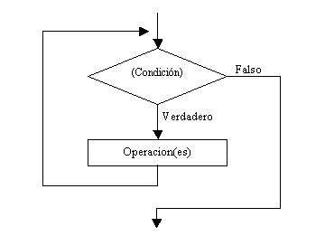

# Estructures iteratives

[Eina per fer diagrames de flux: diagrams](https://app.diagrams.net/)

## Introducció

Els ordinadors estan especialment dissenyats per a les aplicacions en les quals una operació o una sèrie s'han de repetir moltes vegades. La construcció de programació corresponent a aquest cas és el llaç o el **bucle**.

Els bucles es poden classificar en funció de la condició de sortida del mateix de dues maneres:

  - Bucles condicionals.
  - Bucles comptats.

## Bucles condicionals

El bloc de codi a repetir s'executa mentres que se satisfà una certa condició. Quan la condició és falsa, se surt del bucle i es continua executant la següent instrucció que segueix.

A cada iteració (repetició) s'avalua novament la condició. En funció del moment en què s'avalua la condició de manteniment del bucle es classifiquen en:

  - Bucles condicionals provats a l'inici
  - Bucles condicionals provals al final

### Bucle condicional provat a l'inici (while)

La condició s'avalua abans d'executar el bloc intern. Per tant, si la condició no es compleix, el codi del bucle no s'executa cap vegada.



```java
while (condicio) {
  //bloc a executar mentre es compleixi la condicio
  //si no es compleix la primera vegada, aquest bloc no s'executa mai
}
```

### Bucle condicional provat al final (do-while)

La condició s'avalua al final del bloc intern (després de la seva execució). Per tant, sempre s'executa el bloc intern almenys una vegada.


```java
do {
  //bloc a executar mentre es compleixi la condicio
  //encara que la condició sigui falsa la primera vegada, el bloc s'executa una vegada
} while (condicio);
```

## Bucles comptats (for)

S'utilitzen generalment quan es coneix el nombre de vegades que el bloc del bucle s'ha de repetir. Fan servir un comptador per controlar el nombre d'iteracions.


Els bucles *for* en llenguatge *Java* són molt potents i tenen moltes més possibilitats d´us que l'especificat per al recompte d'iteracions.

```java
for (inicialitzacio; condicio; actualitzacio) {
  //bloc a executar mentre es compleixi la condicio
  //si no es compleix la primera vegada, aquest bloc no s'executa mai
}
```
La inicialització s'executa només la primera vegada, en entrar al bucle.

La condició s'avalua i es comprova cada vegada que s'itera.

L'actualització s'executa cada vegada que s'itera al bucle, al igual que el bloc intern.

## Enniuament de bucles

El codi de l'interior del bucle pot també contenir altres bucles, generant estructures per respondre a problemes complexos.

[El algorisme de l'amistat - Sheldon Cooper (The Big Bang Theory)](https://www.youtube.com/watch?v=H3z3HDbl5QU)

## Exemples

```java
import java.util.InputMismatchException;
import java.util.Scanner;
/**
 * Programa que llegeix un nombre enter positiu N
 * i mostra els primers N nombres enters positius
 * @author Jose
 */
public class PrimersNNaturals {
    public static void main(String[] args) {
        Scanner lector = new Scanner(System.in);
        //llegir el número
        System.out.print("Entra el número enter positiu: ");
        try {
            int limit = lector.nextInt();
            if (limit > 0) {
                //amb bucle for
                System.out.println("\nAmb bucle for");
                for (int num = 1; num <= limit; num++) {
                    System.out.format("%d ", num);
                }
                //amb bucle while (provat a l'inici)
                System.out.println("\nAmb bucle while (provat a l'inici)");
                int iter1=1;
                while (iter1 <= limit) {
                    System.out.format("%d ", iter1);
                    iter1++;
                }
                //amb bucle do while (provat al final)
                System.out.println("\nAmb bucle do while (provat al final)");
                int iter2=1;
                do {
                    System.out.format("%d ", iter2);
                    iter2++;
                } while (iter2 <= limit);
            } else {
                System.out.println("Has d'entrar un nombre positiu");
            }            
        } catch (InputMismatchException e) {
            System.out.println("Has d'entrar un número enter positiu");
        }
    }
}
```

```java
/**
 * Imprimeix els primers 20 nombres naturals
 * @author Jose
 */
public class Print20Enters {
    public static void main(String[] args) {
        final int LIMIT = 20;
        //amb bucle while
        //inicialitzar comptador
//        int comptador = 1;
//        while (comptador <= LIMIT) {
//            System.out.println(comptador);
//            comptador++;
//        }  
        //amb bucle for
//        for (int i=1; i<=LIMIT; i++) {
//            System.out.println(i);
//        }
        //amb bucle do while
        int comptador = 1;
        do {
            System.out.println(comptador);
            comptador++;
        } while (comptador <= LIMIT);
    }
}
```