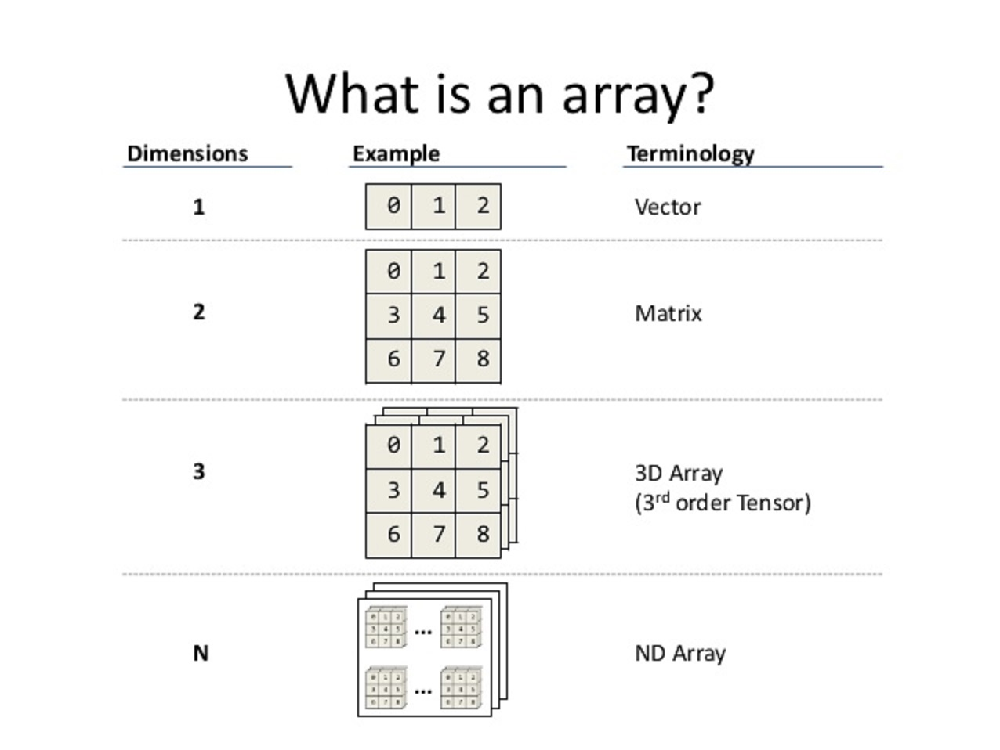
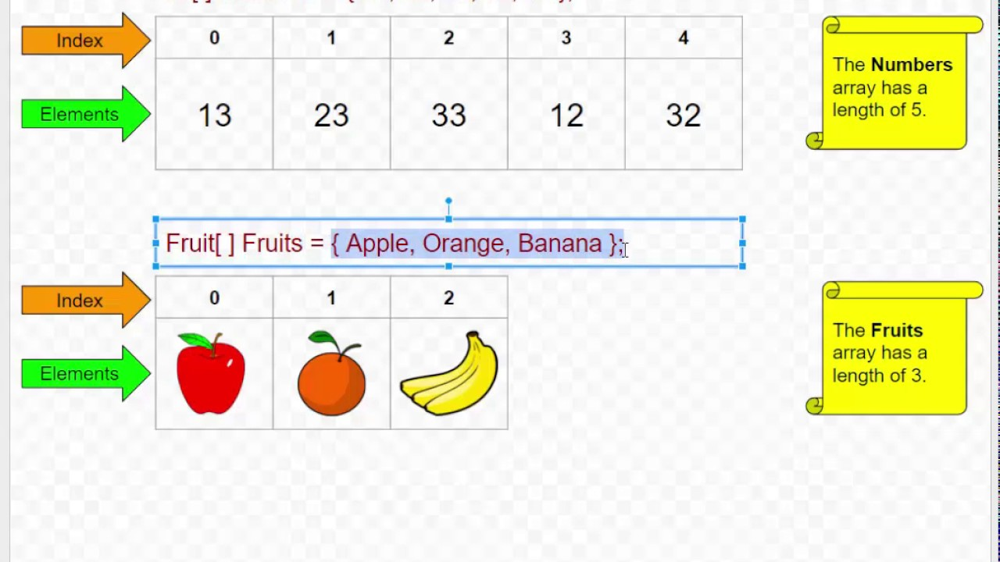

# Estructures unidimensionals

## Arrays en Java

Un *array* és un grup de variables del mateix tipus referides amb un nom comú.

Són objectes, és a dir, són de tipus referencial. Això implica que s'emmagatzemen de forma dinàmica i cal instanciar-los. Els elements de l'array s'emmagatzemen en memòria de forma consecutiva.

Poden ser unidimensionals o de més d'una dimensió.



Com a objectes, tenen atributs i mètodes.

En aquest apartat ens ocuparem dels arrays unidimensionals.

Els elements de l'array s'organitzen seqüencialment. Cada element té en anterior (llevat del primer, amb índex 0) i un posterior (llevat del darrer).

La seva longitud es pot llegir del seu atribut ***length***.

L'accés als seus elements es fa de manera directa utilitzant l'índex de la posició.

Un array pot contenir dades de qualsevol tipus primitiu o referencial, incloent-hi altres arrays.



### Declaració d'arrays

La declaració d'un array declara l'identificador i el tipus d'element que conté.

```java
type ident[];
type [] ident;
```

Exemples

```java
int intArray[];
int [] intArray[]:
float [] floatArray;
String [] stringArray;
```

La declaració no reserva espai en memòria per als elements de l'array. Com que l'array és un objecte, cal instanciar-lo definint a la vegada el nombre d'elements a emmagatzemar.

### Instanciació d'arrays

```java
ident = new type[size];
```

Exemples:

```java
int [] intArray; //declaració
intArray = new int[10];  //instanciació de l'array de 10 elements int.
```

Es pot combinar la declaració i la instanciació:

```java
int [] intArray = new int[10];
```

### Definició abreujada d'arrays amb constants

Es pot declara, instanciar i inicialitzar els elements d'un array amb la següent notació abreujada:

```java
int [] intArray = {10, 20, 30, 40, 50};  //array de 5 elements int
```

### Accés als elements d'un array

L'accés als elements d'un array es fa de manera indexada amb els operadors []. Cal tenir en compte que el primer element té índex **0** i el darrer **length-1**.

```java
int [] intArray = {10, 20, 30, 40, 50};  //array de 5 elements int
int valor = intArray[3];  //accés a l'element amb índex 3
System.out.prinln(valor);  //mostra 40
intArray[2]=31;   //canvia el valor de l'element amb índex 2 (el 30 ara és 31)
```

Podem utilitzar un bucle per recórrer els elements de l'array

```java
for (int i=0; i<intArray.length; i++) {
   System.out.println("Element amb índex "+i+": "+intArray[i]);
}
```

### ArrayIndexOutOfBounds

Quan s'intenta accedir a un elements fora de l'array, es genera l'excepció ***ArrayIndexOutOfBounds***.

```java
int intArray = new int[5];
//...
intArray[7]   //llança excepció
```

### Arrays d'objectes

Quan els elements de l'array són objectes, la instanciació de l'array només crea espai per a les referències als objectes.

Abans de llegir un element, cal instanciar l'objecte que conté.

```java
String [] names = new String[3];  //declaració de l'array de 5 elements String, els quals encara no s'ha creat (són nuls)
System.out.println(names[0]);  //NullPointerException
```

```java
String [] names = {"John", "Martha", "Louis"};   //declara, instancia i inicialitza
System.out.println(names[0]);  //mostra "John"
```

```java
String [] names = new String[3];  //declaració de l'array de 5 elements String, els quals encara no s'ha creat (són nuls)
names[0] = "John";  //instancia i inicialitza String i copia referència la primera posició de l'array
names[1] = "Martha";
names[2] = "Louis";
System.out.println(names[1]);  //mostra "Martha"
```

La sintaxi general per a qualsevol tipus d'objecte (substituir String pel nom de la classe):

```java
String [] names = new String[3];  //declaració de l'array de 5 elements String, els quals encara no s'ha creat (són nuls)
names[0] = new String("John");
names[2] = new String("Martha");
names[2] = new String("Louis");
```

També podem assignar a un element un objecte prèviament construit:

```java
String name = "Peter";  //o String name = new String("Peter");
names[1] = name;
```

### Arrays i mètodes

Els arrays es poden passar com a paràmetres als mètodes i també poden ser retornats per ells.

**Passar array a mètode**

```java
public void printNames(String [] names) {
   for (int i=0; i<names.length; i++) {
      System.out.println(names[i]);
   }
}
```

```java
String [] listOfNames = {"John", "Martha", "Louis"};
printNames(listOfNames);
```

**Retornar arrays des d'un mètode**

```java
public int [] getNotes() {
   //obtenir les notes
   return new int[] {3, 8, 5};
}
```

```java
int [] notes = getNotes();
for (int i=0; i<notes.length; i++) {
   System.out.println(notes[i]);
}
```

### Recorregut d'arrays amb bucle for-each

```java
int[] intArray = { 12, 32, 95, 11, 10 };
for (int elem: intArray) {
   System.out.println(elem);
}
```

Aquests bucles són molt pràctics però no permeten modificar els elements (només la variable d'iteració) ni donen accés a l'índex de l'element.

## Exemples

### Càlculs estadístics amb arrays

Programa que entra un array d'enters, el mostra i calcula la suma dels seus elements, el valor mínim i el valor màxim.

Primera versió amb tot el codi a la mateixa classe i al principal.

```java
import java.util.Scanner;

/**
 * Entra un array, el mostra i calcula suma, mínim i màxim
 * Versió sense funcions
 * @author Jose
 */
public class Ex01a {

    public static void main(String[] args) {
        Scanner lector = new Scanner(System.in);
        //preguntar quants elements
        System.out.print("Quants elements? ");
        int numElements = lector.nextInt();
        //declarar i instanciar l'array
        int [] llista = new int[numElements];
        //llegir els elements
        for (int i=0; i<numElements; i++) {
            //llegir element
            System.out.print("Element "+i+": ");
            int elem = lector.nextInt();
            //posar-lo a la llista
            llista[i] = elem;
        }
        //mostrar la llista
        for (int i=0; i<numElements; i++) {
            System.out.print(" "+llista[i]);
        }
        System.out.println("");
        //calcular suma
        int suma = 0;
        for (int i=0; i<numElements; i++) {
            suma += llista[i];
        }
        System.out.println("Suma: "+suma);
        //calcular mínim
        int minim = llista[0];
        for (int i=0; i<numElements; i++) {
            if (llista[i] < minim) {
                minim = llista[i];
            }
        }
        System.out.println("Mínim: "+minim);
        //calcular màxim
        int maxim = llista[0];
        for (int i=0; i<numElements; i++) {
            if (maxim < llista[i]) {
                maxim = llista[i];
            }
        }
        System.out.println("Màxim: "+maxim);
        
    }
    
}
```

Segona versió amb funcions a la classe principal

```java
import java.util.Scanner;

/**
 * Entra un array, el mostra i calcula suma, mínim i màxim
 * Versió amb funcions a la mateixa classe
 * @author Jose
 */
public class Ex01b {

    public static void main(String[] args) {
        Scanner lector = new Scanner(System.in);
        //preguntar quants elements
        System.out.print("Quants elements? ");
        int numElements = lector.nextInt();
        //declarar i llegir la llista
        int [] llista = llegirLlista(numElements);
        //mostrar la llista
        mostrarLlista(llista);
        //calcular suma
        int suma = calcularSuma(llista);
        System.out.println("Suma: "+suma);
        //calcular mínim
        int minim = calcularMinim(llista);
        System.out.println("Mínim: "+minim);
        //calcular màxim
        int maxim = calcularMaxim(llista);
        System.out.println("Màxim: "+maxim);
        
    }
    
    /**
     * llegeix una llista d'enters de la longitud especificada
     * @param longitud nombre d'elements a llegir
     * @return array amb la llista
     */
    public static int [] llegirLlista(int longitud) {
        Scanner lector = new Scanner(System.in);
        //declarar i instanciar l'array
        int [] dades = new int[longitud];
        //llegir els elements
        for (int i=0; i<longitud; i++) {
            //llegir element
            System.out.print("Element "+i+": ");
            int elem = lector.nextInt();
            //posar-lo a la llista
            dades[i] = elem;
        }
        return dades;
    }
    
    /**
     * mostra per pantalla unaarray d'enters
     * @param dades l'array a mostrar
     */
    public static void mostrarLlista(int [] dades) {
        //mostrar la llista
        for (int i=0; i<dades.length; i++) {
            System.out.print(" "+dades[i]);
        } 
        System.out.println("");
    }
    
    /**
     * calcula la suma dels elements de l'array
     * @param dades l'array els elements del qual cal sumar
     * @return la suma dels elements de l'array
     */
    public static int calcularSuma(int [] dades) {
        int suma = 0;
        for (int i=0; i<dades.length; i++) {
            suma += dades[i];
        }  
        return suma;
    }
    
    /**
     * calcula el mínim dels elements de l'array
     * @param dades l'array del qual cal calcular el mínim
     * @return el mínim dels elements de l'array
     */
    public static int calcularMinim(int [] dades) {
        int minim = dades[0];
        for (int i=0; i<dades.length; i++) {
            if (dades[i] < minim) {
                minim = dades[i];
            }
        }  
        return minim;
    }
   
    /**
     * calcula el màxim dels elements de l'array
     * @param dades l'array del qual cal calcular el màxim
     * @return el màxim dels elements de l'array
     */
    public static int calcularMaxim(int [] dades) {
        int maxim = dades[0];
        for (int i=0; i<dades.length; i++) {
            if (maxim < dades[i]) {
                maxim = dades[i];
            }
        }  
        return maxim;
    }
    
}
```

Tercera versió amb els mètodes a una classe separada que fa de biblioteca de funcions.

```java
import java.util.Scanner;

/**
 * Entra un array, el mostra i calcula suma, mínim i màxim
 * Versió amb funcions a una altra classe
 * @author Jose
 */
public class Ex01c {

    public static void main(String[] args) {
        Scanner lector = new Scanner(System.in);
        //preguntar quants elements
        System.out.print("Quants elements? ");
        int numElements = lector.nextInt();
        //declarar i llegir la llista
        int [] llista = llegirLlista(numElements);
        //mostrar la llista
        mostrarLlista(llista);
        //calcular suma
        int suma = Estadistica.calcularSuma(llista);
        System.out.println("Suma: "+suma);
        //calcular mínim
        int minim = Estadistica.calcularMinim(llista);
        System.out.println("Mínim: "+minim);
        //calcular màxim
        int maxim = Estadistica.calcularMaxim(llista);
        System.out.println("Màxim: "+maxim);
        
    }
    
    /**
     * llegeix una llista d'enters de la longitud especificada
     * @param longitud nombre d'elements a llegir
     * @return array amb la llista
     */
    public static int [] llegirLlista(int longitud) {
        Scanner lector = new Scanner(System.in);
        //declarar i instanciar l'array
        int [] dades = new int[longitud];
        //llegir els elements
        for (int i=0; i<longitud; i++) {
            //llegir element
            System.out.print("Element "+i+": ");
            int elem = lector.nextInt();
            //posar-lo a la llista
            dades[i] = elem;
        }
        return dades;
    }
    
    /**
     * mostra per pantalla un array d'enters
     * @param dades l'array a mostrar
     */
    public static void mostrarLlista(int [] dades) {
        //mostrar la llista
        for (int i=0; i<dades.length; i++) {
            System.out.print(" "+dades[i]);
        } 
        System.out.println("");
    }
    
}
```

on la classe biblioteca és aquesta

```java
/**
 * Classe per fer càlculs estadístics amb arrays
 *
 * @author Jose
 */
public class Estadistica {

    /**
     * calcula la suma dels elements de l'array
     *
     * @param dades l'array els elements del qual cal sumar
     * @return la suma dels elements de l'array
     */
    public static int calcularSuma(int[] dades) {
        int suma = 0;
        for (int i = 0; i < dades.length; i++) {
            suma += dades[i];
        }
        return suma;
    }

    /**
     * calcula el mínim dels elements de l'array
     *
     * @param dades l'array del qual cal calcular el mínim
     * @return el mínim dels elements de l'array
     */
    public static int calcularMinim(int[] dades) {
        int minim = dades[0];
        for (int i = 0; i < dades.length; i++) {
            if (dades[i] < minim) {
                minim = dades[i];
            }
        }
        return minim;
    }

    /**
     * calcula el màxim dels elements de l'array
     *
     * @param dades l'array del qual cal calcular el màxim
     * @return el màxim dels elements de l'array
     */
    public static int calcularMaxim(int[] dades) {
        int maxim = dades[0];
        for (int i = 0; i < dades.length; i++) {
            if (maxim < dades[i]) {
                maxim = dades[i];
            }
        }
        return maxim;
    }

}
```

Exercici proposat:
Afegir a la classe *Estadistica.java* mètodes per calcular la mitjana aritmètica i la desviació estàndard. Provar-ne el funcionament invocant-les des de la classe principal.


## La classe Arrays

La classe [java.util.Arrays](https://docs.oracle.com/en/java/javase/17/docs/api/java.base/java/util/Arrays.html) conté nombrosos mètodes estàtics per manipular arrays.

[Tutorial d'ús de la classe Arrays](https://www.geeksforgeeks.org/array-class-in-java/)

A tall d'exemple (T representa qualsevol tipus de dades):

```static String toString(T[] a)``` retorna una representació en format *String* de l'array.

```static void sort(T[] a)``` ordena en ordre ascendent l'array.

```static void fill(T[] a, T val)``` assigna el valor *val* a tots els elements de l'array.

```java
int [] dades = {10, 6, 2, 5, 7};
System.out.println( Arrays.toString(dades) );  //mostra [10, 6, 2, 5, 7]
Arrays.sort( dades );   //ordena l'array dades de menor a major
System.out.println( Arrays.toString(dades) );  //mostra [2, 5, 6, 7, 10]
dades = Arrays.fill( dades, 9 );  //omple l'array dades amb 9's
System.out.println( Arrays.toString(dades) );  //mostra [9, 9, 9, 9, 9]
```

