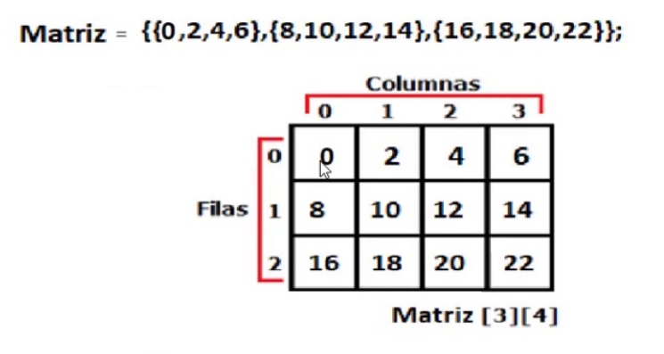

# Taules i estructures multidimensionals

## Arrays amb dimensions fixes

Els arrays multidimensionals en Java consisteixen en arrays d'arrays, és a dir, arrays on cada element és a la seva vegada un array.

Ens centrarem en aquest apartat sobretot en arrays bidimensionals, també anomenats taules o matrius.

```java
//Two dimensional array (10x20 elements):
int[][] arr2D = new int[10][20];

//Three dimensional array (10x15x5 elements):
int[][][] arr3D = new int[10][15][5];
```



El nombre d'elements emmagatzemats en un array multidimensional s'obté fent el producte de totes les seves longituds.


L'accés als elements es fa amb els índexs de cada dimensió (en ordre). En el cas d'arrays bidimensionals podem imaginar-los com taules o matrius organitzats en files (primer índex) i columnes (segon índex).

```java
int[][] arr2D = new int[3][2];
arr2D[0][1] = 3; //element a la primera fila, segona columna.
```

Es poden inicialitzar amb la notació abreujada {}.

```java
int[][] arr2D = { {1, 2}, {3, 4}, {5, 6} };
for (int i=0; i<3; i++) {  //i recorre les files (primera dimensió)
    for (int j=0; j<2; j++) {  //j recorre les columnes (segona dimensió)
        System.out.format("arr[%d][%d]=%d", i, j, arr2D[i][j]);
    }
}
```

O també es poden inicialitzar en qualsevol lloc del codi instanciant un array per a l'element corresponent.

```java
int [][] arr3x2 = new int[3][2];
int [] arr1x2 = new int[2];
arr1x2[0] = 1;
arr1x2[1] = 2;
arr2D[0][0] = arr1x2;
//el mateix amb les altres files (1 i 2)
```

o també
```java
int [][] arr3x2 = new int[3][2];
int [] arr1x2 = {1, 2};
arr2D[0][0] = arr1x2;
//el mateix amb les altres files (1 i 2)
```

### Exemples amb arrays bidimensionals

```java
import java.util.Arrays;
import java.util.Random;

/**
 *
 * @author Jose
 */
public class Matrius {

    public static void main(String[] args) {
        //declarar matriu i generar-la i inicialitzar-la amb un mètode
        int [][] matriu = generarMatriuAleatoria(3, 4);
        //   mostrar matriu en format unilínia
        System.out.println(matrixToString(matriu));
        //declarar i instanciar matriu i inicialitzar-la amb un mètode
        int [][] matriu2 = new int [3][4];
        inicialitzarMatriuAleatoria(matriu2);
        //   mostrar matriu en format unilínia
        System.out.println(matrixToString(matriu2));
        //mostrar matriu en format taula
        System.out.println(matrixToTable(matriu));
    }
    
    /**
     * declara, instancia i inicialitza amb dades aleatòries
     * una matriu amb les files i columnes especificades
     * @param files el número de files de la matriu
     * @param columnes el número de columnes de la matriu
     * @return la matriu amb les dades
     */
    public static int [][] generarMatriuAleatoria(int files, int columnes) {
        int [][] dades = new int[files][columnes];
        final int MAX_VALOR = 100;
        Random rnd = new Random();
        for (int i = 0; i < dades.length; i++) {
            for (int j = 0; j < dades[i].length; j++) {
                dades[i][j] = rnd.nextInt(MAX_VALOR);
            }
        }
        return dades;
    }
    
    /**
     * inicialitza una matriu amb dades aleatòries
     * com que el paràmetre 'dades' és una referència,
     * es pot usar per accedir als elements de la matriu 
     * i canviar els seus valors.
     * @param dades la matriu a omplir
     */
    public static void inicialitzarMatriuAleatoria(int [][] dades) {
        final int MAX_VALOR = 100;
        Random rnd = new Random();
        for (int i = 0; i < dades.length; i++) {
            for (int j = 0; j < dades[i].length; j++) {
                dades[i][j] = rnd.nextInt(MAX_VALOR);
            }
        }        
    }
    
    /**
     * genera un format String unilínia de la matriu
     * @param dades la matriu a representar
     * @return String amb la matriu en format unilínia
     */
    public static String matrixToString(int [][] dades) {
        StringBuilder sb = new StringBuilder();
        sb.append("[");
        for (int i = 0; i < dades.length; i++) {
            sb.append(Arrays.toString(dades[i]));
            if (i<dades.length-1) sb.append(", ");
        }
        sb.append("]");
        return sb.toString();
    }

    /**
     * genera un format tabular per a una matriu
     * @param dades la matriu a tabular
     * @return format String tabular de la matriu
     */
    public static String matrixToTable(int [][] dades) {
        StringBuilder sb = new StringBuilder();
        //sb.append("[");
        for (int i = 0; i < dades.length; i++) {
            for (int j = 0; j < dades[i].length; j++) {
                sb.append(dades[i][j]);
                if (j<dades[i].length-1) sb.append("\t");
            }
            if (i<dades.length-1) sb.append("\n");
        }
        //sb.append("]");
        return sb.toString();
    }
 
}
```

```java
//llegir array bidimensional de teclat
Scanner lector = new Scanner(System.in);
System.out.print("Nombre de files: ");
int numFiles = lector.nextInt();
System.out.print("Nombre de columnes: ");
int numColumnes = lector.nextInt();
//declarar i instanciar la matriu de dades
int [][] dades = new int[numFiles][numColumnes];
//llegir dades de l'usuari
for (int i = 0; i < numFiles; i++) {  //bucle per recórrer les files
    for (int j = 0; j < numColumnes; j++) {  //bucle per recórrer les columnes (cel·les de cada fila)
        System.out.format("dades[%d][%d]: ", i, j);
        dades[i][j] = lector.nextInt();
    }
}
```
