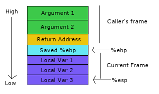

# Estructura de la memòria de programa

Els tipus d'emmagatzematge de dades pot ser:

* Estàtic
* Automàtic
* Dinàmic

L'**emmagatazematge estàtic** es produeix a l'inici de l'execució del programa. El temps de vida de les dades estàtiques s'extén al llarg de tota l'execució del programa.

L'**emmagatzematge automàtic** el fa el compilador a mesura que gestiona la pila d'invocacions als diferents mètodes del programa. Cada vegada que s'entra en un mètode, es copien a la pila (*stack*) els arguments o paràmetres de la invocació i a continuació es fa el mateix amb les variables locals del mètode. Quan se surt del mètode (retorn), es restaura la pila al mateix estat que tenia abans de la invocació i les variables creades es fan inaccessibles.

L'**emmagatzematge dinàmic** es produeix d'acord amb les instruccions del programador. Els **tipus de dades referencials** (objectes) es declaren de forma automàtica, però en instanciar-los (amb l'operador *new*) es reserva memòria per a ells de manera dinàmica a una zona de memòria anomenada **monticle** (*heap*). Quan no es necessita més aquesta variable, el reciclador de memòria elimina de manera dinàmica la memòria reservada al *heap*, la qual cosa pot provocar espais buits de memòria en aquesta zona.

L'*stack* i el *heap* compareixen un mateix segment de memòria. Mentre que l'stack creix cap avall (adreces de memòria més baixes), el heap ho fa cap amunt (adreces de memòria més altes).

