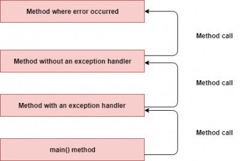

# Control d'excepcions

## Continguts

* Llançament i captura d'excepcions.
* Excepcions del llenguatge.
* Definició de tipus d'excepcions específics.

[Apunts d'excepcions](assets/5.1/5.1.1/dax2_m03-a511-Excepcions.pdf)

[Exemple de captura d'excepcions en el mateix mètode](assets/5.1/5.1.1/Excepcio1.java)

[Exemple de captura d'excepcions en diferent mètode](assets/5.1/5.1.1/Excepcio2.java)

[Exemple de captura de múltiples excepcions](assets/5.1/5.1.1/Exception3.java)

[Exemple de definició d'excepcions](assets/5.1/5.1.1/Eq2nGrauTest.java). Il·lustra la resolució d'equacions de segon grau definint excepcions per als casos que no hi ha solució i es poden produir errors.

[Exemple d'ús d'excepcions per a mantenir la coherència de les dades: Classe Person](assets/5.1/5.1.1/Person_with_exceptions.zip)
