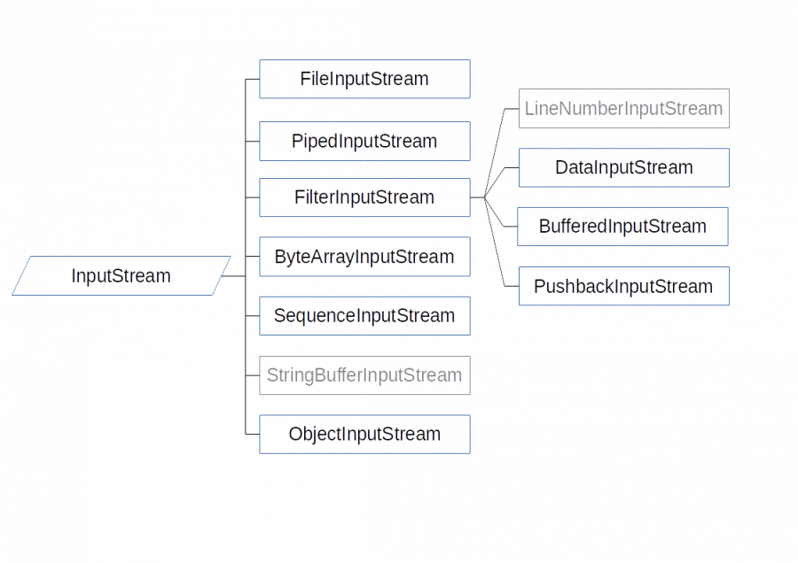
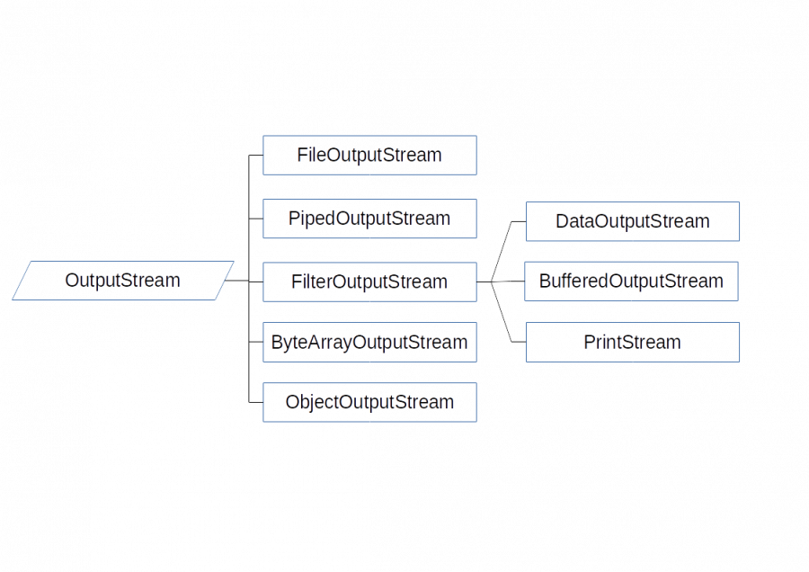
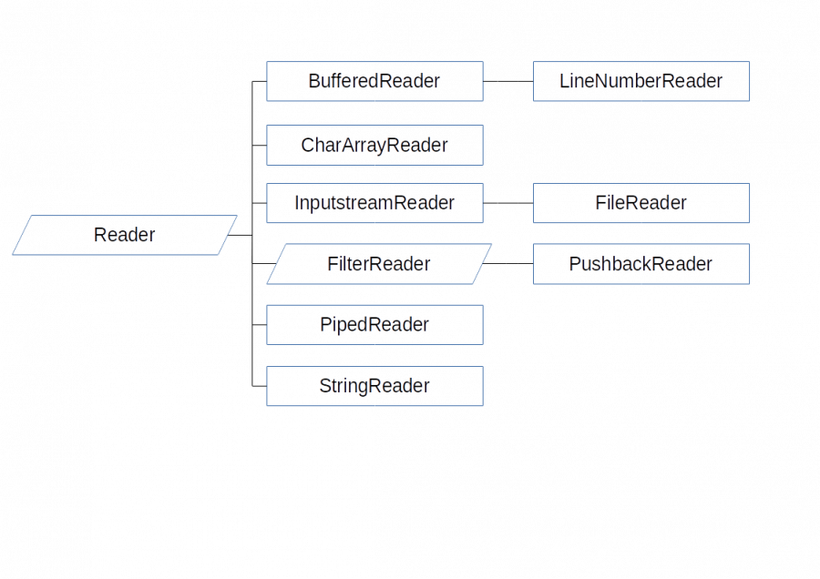
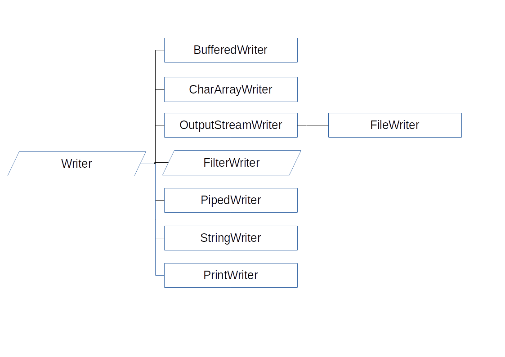

# Fluxos d'informació i XML

## Continguts

* Gestió del sistema de fitxers.
* Fluxos d'informació. Jerarquia de classes.
* Biblioteques de classes per a fitxers XML.


[Apuns de fluxos d'informació](assets/5.1/5.1.3/dax2_m03-a513-Fluxos_informacio.pdf)

## Gestió del sistema de fitxers.

[Exemple de llistat del contingut d'un directori: DirList.java](assets/5.1/5.1.3/DirList.java)

[Exemple de llistat dels atributs d'un fitxer: FileAttributes.java](assets/5.1/5.1.3/FileAttributes.java)

Exercici proposat:
Programa que llisti els fitxers d'un diretori amb els seus atributs, segons els paràmetres entrat des del terminal.
Format d'execució:  dla -[params] [path]
on 
* params pot ser '1' per llistar només noms en columna o 'a' per llistar tots els atributs possibles en una línia per a cada fitxer.
* path és la ruta al directoria a mostrar (pot ser relativa o absoluta)

## Fluxos d'informació. Jerarquia de classes.

Els programes poden enviar fluxos de dades (streams) o rebre'ls cap a o des de diferents orígens i destinacions. Ens centrarem bàsicament en streams per llegir i escriure fitxers.

Els streams es categoritzen en quatre grans blocs segons dues propietats:
* Direcció: entrada o sortida
* Codificació: orientats a byte o orientats a caràcter

Byte input streams 

Byte output streams 

Char input streams 

Char output streams 

En primer lloc provem exemples d'escriptura i lectura senzilla de bytes i de caràcters. Més endavant provarem exemples per fer persistents dades primitives i objectes.

### Videos d'introducció a fitxers
(de Píldoras informáticas)
* [Lectura de text](https://youtu.be/etQN4EfYN7k)
* [Escriptura de text](https://youtu.be/E0H4OzW2_1Y)
* [Lectura i escriptura de text amb buffer](https://youtu.be/YCCE4sbmWrw)
* [Lectura binària](https://youtu.be/38YBRnJtQEw)
* [Escriptura binària](https://youtu.be/v6ctWhhTFrk)

### Byte output stream

```
import java.io.File;
import java.io.FileOutputStream;
import java.io.IOException;
/**
 * WriteBytes.java
 * Example writing bytes to a file
 * @author ProvenSoft
 */
public class WriteBytes {
	public static void main(String[] args) {
		byte [] list ={10, 15, 25, 30, 45};
		if(args.length == 1) {	 //check parameter length 
			File f = new File(args[0]);
			try{
				FileOutputStream fos = new FileOutputStream(f);
				for(int i = 0; i < list.length; i++){
					fos.write(list[i]);
					fos.flush();
				}
				fos.close();
			} catch(IOException e) {
				System.out.println("Input or output problem related to this exception:");
				e.printStackTrace();
			}
		}
		else {
			System.out.println("Usage: WriteBytes filename");
		}
	}
}
```

### Byte input stream

```
import java.io.File;
import java.io.FileInputStream;
import java.io.FileNotFoundException;
import java.io.IOException;
/**
 * ReadBytes.java
 * Example reading bytes from file
 * @author ProvenSoft
 */
public class ReadBytes {
	public static void main(String[] args) {
		if(args.length == 1) {	 //check parameter length 
			File f = new File(args[0]);
			int x=0; //byte llegit 
			try{
				FileInputStream fis = new FileInputStream(f);
				while ((x = fis.read()) != -1) { //while not end of file,  keep reading
					System.out.print(" "+(byte)x);
				}
				System.out.print("\n");
				fis.close();
			} catch(FileNotFoundException e){
				System.out.println("File not found. Exception info:");
				e.printStackTrace();
			} catch(IOException e) {
				System.out.println("Input or output problem related to this exception:");
				e.printStackTrace();
			}
		}
		else {
			System.out.println("Usage: ReadBytes filename");
		}
	}
}
```

### Char output stream

```
import java.io.*;
/**
 * WriteChars.java
 * Example writing characters to a file
 * @author ProvenSoft
 */
public class WriteChars {
	public static void main(String[] args) {
		char [] list = {'a', 'e', 'i', 'o', 'u'};
		if(args.length == 1) {	//check parameter length 
			try{
				BufferedWriter bw = new BufferedWriter(new FileWriter(args[0]));
				for(int i = 0; i < list.length; i++){
					bw.write(list[i]);
				}
				bw.close();
			} catch(IOException e) {
				System.out.println("Input or output problem related to this exception:");
				e.printStackTrace();
			}
		}
		else {
			System.out.println("Usage: WriteChars filename");
		}
	}
}
```

### Char input stream

```
/**
 * ReadChars.java
 * Example reading characters from file
 * @author ProvenSoft
 */
public class ReadChars {
	public static void main(String[] args) {
		int c; //character read
		if(args.length == 1) {	//check parameter length
			try{
			BufferedReader br = new BufferedReader(new FileReader(args[0]));
			while ((c=br.read()) != -1) {
				System.out.print((char)c);
			}
			System.out.print("\n");
			br.close();
			} catch (FileNotFoundException e){
				System.out.println ("File not found. Exception info:");
				//e.printStackTrace();
			} catch(IOException e) {
				System.out.println("Input or output problem related to this exception:");
				e.printStackTrace();
			}
		}
		else {
			System.out.println("Usage: ReadChars filename");
		}
	}
}
```

### Seriació de tipus primitius

Utilitzem les classes [***DataInputStream***](https://docs.oracle.com/en/java/javase/17/docs/api/java.base/java/io/DataInputStream.html) i [***DataOutStream***](https://docs.oracle.com/en/java/javase/17/docs/api/java.base/java/io/DataOutputStream.html), les quals proveeixen mètodes per a la persistència de cada tipus primitiu.

```
import java.io.*;
/** DataStreamExample01.java
 * Example of using DataInputStream and DataOutputStream.
 * @author Jose
 */
public class DataStreamExample01 {
	public static void main(String [] args) {
		// write information to file.
		writeInfo();
		// read information from file.
		readAndShowInfo();
	}
	
	private static void writeInfo() {
		int age = 30;
		double salary = 1000.0;
		String name = "Peter";
		System.out.println("Writing to file ...");
		try {
			DataOutputStream dos = new DataOutputStream(
				new FileOutputStream("myData.txt")
			);
			// do some stuff with the file.
			dos.writeInt(age);
			dos.writeDouble(salary);
			dos.writeUTF(name);
			// close the file.
			dos.flush();
			dos.close();
		} catch (IOException e) {
			e.printStackTrace();
		}
	}
	
	private static void readAndShowInfo() {
		System.out.println("Reading from file ...");
		try {
			DataInputStream dis = new DataInputStream(
				new FileInputStream("myData.txt")
			);
			// read data from file.
			int age = dis.readInt();
			double salary = dis.readDouble();
			String name = dis.readUTF();
			// show data to console.
			System.out.format("age=%d\n", age);
			System.out.format("salary=%f\n", salary);
			System.out.format("name=%s\n", name);
		} catch (IOException e) {
			e.printStackTrace();
		}			
	}
	
}
```

### Seriació d'objectes

La **seriació** (*serialization*) és el procés d'escriure un objecte a un stream de bytes. És útil quan es vol fer persistent l'estat d'un programa a un fitxer per exemple. El procés invers s'anomena **deseriació** (*deserialization*).

Només els objectes que implementen l'interfície [***Serializable***](https://docs.oracle.com/en/java/javase/17/docs/api/java.base/java/io/Serializable.html) poden ser desats i restaurats usant la serialització. Si una classe és serialitzable, totes les seves subclasses també ho són.

Nota: les variables ***transient*** i ***static*** no es guarden durant la serialització.
Usarem les **interfícies** ***ObjectOutput*** i ***ObjectInput***, i les **classes** ***ObjectOutputStream*** i ***ObjectInputStream***, que les implementen.


La interfície [***ObjectOutput***](https://docs.oracle.com/en/java/javase/17/docs/api/java.base/java/io/ObjectOutput.html) extén les interfícies ***DataOutput*** i ***AutoCloseable*** i suporta serialització. Defineix els mètodes ***close()***, ***flush()***, ***write()*** i ***writeObject()***. Aquest últim s'invoca per serialitzar un objecte. Tots els mètodes llancen ***IOException*** si es produeix un error.

La interfície [***ObjectInput***](https://docs.oracle.com/en/java/javase/17/docs/api/java.base/java/io/ObjectInput.html) extén les interfícies ***DataInput*** i ***AutoCloseable*** i suporta serialització. Defineix els mètodes ***close()***, ***available()***, ***read()*** i ***readObject()***. Aquest últim s'invoca per llegir un objecte serialitzat. Tots els mètodes llancen ***IOException*** si es produeix un error. El mètode ***readObject()*** pot llançar també l'excepció ***ClassNotFoundException***.

La classe [***ObjectOutputStream***](https://docs.oracle.com/en/java/javase/17/docs/api/java.base/java/io/ObjectOutputStream.html) extén ***OutputStream*** i implementa la interfície ***ObjectOutput***. El seu constructor és: ***ObjectOutputStream(OutputStream outStream) throws IOException***
La classe [***ObjectInputStream***](https://docs.oracle.com/en/java/javase/17/docs/api/java.base/java/io/ObjectInputStream.html) extén ***InputStream*** i implementa la interfície ***ObjectInput***. El seu constructor és: ***ObjectInputStream(InputStream inStream) throws IOException***.

Consulteu la documentació online de Java per a la llista de mètodes que implementen les dues classes anteriors.

[Exemple de seriació d'objectes a fitxer en binari](assets/5.1/5.1.3/exampleobjectstream.zip)

## Biblioteques de classes per a fitxers XML.

Per treballar amb fitxers en format [XML](https://en.wikipedia.org/wiki/XML), Java proporciona dues biblioteques:
* **SAX (Simple API for XML)**
* **DOM (Document Object Model)**

### SAX

[Manual de SAX](assets/5.1/5.1.3_xml/Simple_API_for_XML.pdf)

[Exemple de SAX parser sense i amb validació](assets/5.1/5.1.3_xml/sax_xml_parser.rar)

[Exemple de lectura XML i conversió a objectes: el banc](assets/5.1/5.1.3_xml/SaxParserBankAccount.zip)

### DOM

No el treballarem en aquest mòdul.