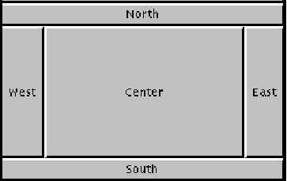

# Conceptes bàsics de GUI

## Continguts

* Components i contenidors
* Disposicions (*layouts*)
* Esdeveniments i observadors


Per programar interfícies gràfiques d'usuari (*GUI*) utilitzarem la biblioteca ***Swing***. Aquesta biblioteca està construida amb paradigma d'orientació a components, on cada component implementa una variant de l'arquitectura model-vista-controlador (*MVC*), semblant a la coneguda amb el nom model-vista-presentador.

[Apunts de Conceptes bàsics de programació amb GUI en Java](assets/5.2/dax2_m03-a521-GUI_conceptes_basics.pdf)

[Presentació de GUI amb Swing](assets/5.2/gui_amb_swing.pdf)

### Primera aplicació amb Swing

[HelloWorldSwing.java (descàrrega)](assets/5.2/HelloWorldSwing.java)
```
import javax.swing.*;        

public class HelloWorldSwing {
    /**
     * Create the GUI and show it.  For thread safety,
     * this method should be invoked from the
     * event-dispatching thread.
     */
    private static void createAndShowGUI() {
        //Make sure we have nice window decorations.
        JFrame.setDefaultLookAndFeelDecorated(true);

        //Create and set up the window.
        JFrame frame = new JFrame("HelloWorldSwing");
        frame.setDefaultCloseOperation(JFrame.EXIT_ON_CLOSE);

        //Add the ubiquitous "Hello World" label.
        JLabel label = new JLabel("Hello World");
        frame.getContentPane().add(label);

        //Display the window.
        frame.pack();
        frame.setVisible(true);
    }

    public static void main(String[] args) {
        //Schedule a job for the event-dispatching thread:
        //creating and showing this application's GUI.
        javax.swing.SwingUtilities.invokeLater(new Runnable() {
            public void run() {
                createAndShowGUI();
            }
        });
    }
}
```

### BorderLayout

[BorderLayout](https://docs.oracle.com/en/java/javase/17/docs/api/java.desktop/java/awt/BorderLayout.html) disposa els elements d'un contenidor en 5 regions: nord, sud, est, oest i centre. En afegir cada component al contenidor, cal especificar a quina posició ha d'anar.



    Panel p = new Panel();
    p.setLayout(new BorderLayout());
    p.add(new Button("Okay"), BorderLayout.SOUTH);

[BorderLayoutExample.java (descàrrega)](assets/5.2/BorderLayoutExample.java)
```
import java.awt.*;
import java.awt.event.*;
import javax.swing.*;        
/**
 * BorderLayoutExample.java
 * Exemple d'us de BorderLayout.
 * @author Jose Moreno
 */
public class BorderLayoutExample {

    private static void initGUI() {

        JFrame frame = new JFrame("BorderLayoutExample");
        frame.setDefaultCloseOperation(JFrame.EXIT_ON_CLOSE);
		//afegir adaptador per a l'esdeveniment de tancament de la finestra
		frame.addWindowListener(new WindowAdapter() {
			public void windowClosing(WindowEvent e)
			{
				System.exit(0);
			}
		});
        //obtenir el panell de contingut de la finestra.
		Container pane = frame.getContentPane();
		//configurar el layout (per defecte ja és BorderLayout).
		pane.setLayout(new BorderLayout());

		//crear array de referències a JLabel
		JLabel [] etiq = new JLabel[5];
		//inicialitzar etiquetes
		etiq[0] = new JLabel( "Etiqueta A" );
		etiq[0].setHorizontalAlignment( SwingConstants.CENTER );
		etiq[1] = new JLabel( "Etiqueta B" );
		etiq[1].setHorizontalAlignment( SwingConstants.CENTER );
		etiq[1].setBackground( Color.YELLOW );
		etiq[1].setOpaque(true); //per defecte, els components són transparents.
		etiq[2] = new JLabel( "Etiqueta C" );
		etiq[2].setHorizontalAlignment( SwingConstants.CENTER );
		etiq[2].setBackground( Color.BLUE );
		etiq[2].setForeground( Color.WHITE );
		etiq[2].setOpaque(true);
		etiq[3] = new JLabel( "Etiqueta D" );
		etiq[3].setHorizontalAlignment( SwingConstants.CENTER );
		etiq[3].setBackground( Color.CYAN );
		etiq[3].setOpaque(true);
		etiq[4] = new JLabel( "Etiqueta E" );
		etiq[4].setHorizontalAlignment( SwingConstants.CENTER );
		etiq[4].setBackground( Color.BLACK );
		etiq[4].setForeground( Color.PINK );
		etiq[4].setOpaque(true);
		//afegir components al panell de continguts de la finestra.
		pane.add( etiq[0], BorderLayout.NORTH );
		pane.add( etiq[1], BorderLayout.SOUTH );
		pane.add( etiq[2], BorderLayout.EAST );
		pane.add( etiq[3], BorderLayout.WEST );
		pane.add( etiq[4], BorderLayout.CENTER );
		
		//dimensionar i mostrar la finestra.
        frame.setSize(300, 200);
        frame.setLocationRelativeTo(null);
        frame.setVisible(true);
    }

    public static void main(String[] args) {
        javax.swing.SwingUtilities.invokeLater(new Runnable() {
            public void run() {
                initGUI();
            }
        });
    }
}
```
### Layouts

[Layouts swing (from www.jairogarciarincon.com)](https://www.jairogarciarincon.com/clase/interfaces-de-usuario-con-java-swing/layout-managers-o-gestores-de-composicion)